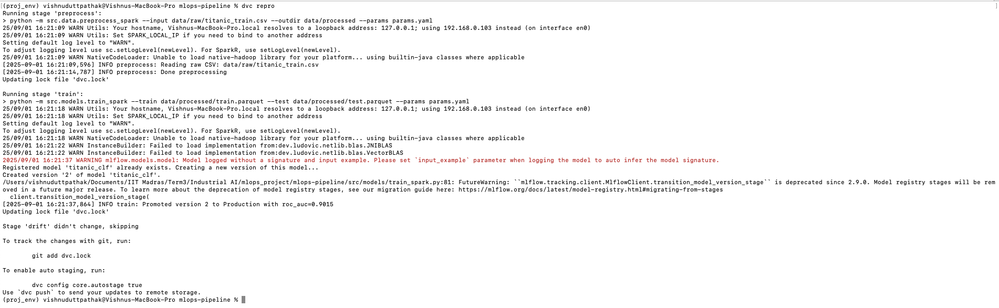

# MLOps Pipeline — Titanic (Spark + DVC + MLflow + FastAPI)

This is a complete starter implementing Spark preprocessing/training, DVC orchestration,
MLflow tracking & Model Registry, FastAPI serving, drift detection, and a CI retrain workflow.

## Quickstart
```bash
pip install -r requirements.txt
git init && dvc init
# Put Kaggle Titanic CSV at:
# data/raw/titanic.csv
export MLFLOW_TRACKING_URI="mlruns"
dvc repro
uvicorn serve.api:app --host 0.0.0.0 --port 8000
mlflow server --backend-store-uri sqlite:///mlflow.db --default-artifact-root ./mlruns --host 0.0.0.0 --port 2000 
```
Used different port in mlflow and fast api server to avoid conflict error or port used error.

or you can run Makefile directly 

## Commands

`dvc repro` automates running your ML/DS pipeline by detecting what's changed and reproducing only the necessary steps.

If every command mentioned in dvc.yaml file work perfectly, it will look something like below.


## Stages
- preprocess → Spark cleans/featurizes data, saves train/test Parquet + baseline stats
- train → Spark MLlib LR/RF + (optional) Cross-Validation; logs to MLflow; registers model; auto-promotes best to Production
- drift → PSI-based drift check on new batch; CI can retrain automatically

# Issue

If facing pyspark issue like different python version used by the PySpark driver program is different from the Python version used by the PySpark worker processes then set `PYSPARK_PYTHON` and `PYSPARK_DRIVER_PYTHON` path. For e.g. 

export PYSPARK_DRIVER_PYTHON=/path/to/python3.12
export PYSPARK_PYTHON=/path/to/python3.12


## Pipeline

          ┌────────────┐
          │   Data     │
          │ Ingestion  │
          └─────┬──────┘
                │
        ┌───────▼─────────┐
        │ Data Preprocess │  (PySpark)
        └───────┬─────────┘
                │
        ┌───────▼─────────┐
        │  Model Training │  (DVC tracked)
        └───────┬─────────┘
                │
        ┌───────▼─────────┐
        │   Evaluation    │
        └───────┬─────────┘
                │
        ┌───────▼─────────┐
        │   Deployment    │  (FastAPI + Docker)
        └───────┬─────────┘
                │
        ┌───────▼─────────┐
        │   Monitoring    │
        └───────┬─────────┘
                │
         Feedback Loop → retraining

   (All steps orchestrated with Git + DVC + Makefile for CI/CD)


